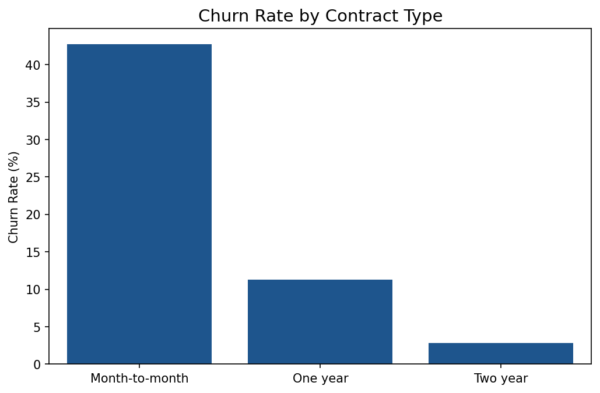
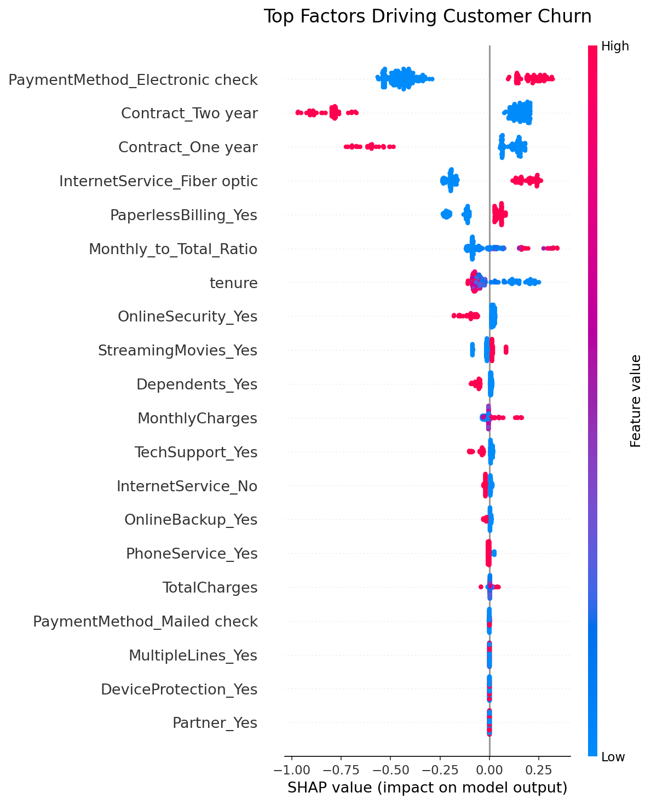

# 🛡️ ChurnGuardian AI  
### 🔮 Predict Customer Churn with 89% Recall | 🌐 Live Dashboard | 💼 Business-Ready

> **A full-stack data science solution** that predicts which customers will leave — and **what to do about it**.  
> Built for telecom, SaaS, and subscription businesses to **reduce churn by 30%+**.

🚀 **Live Demo**: [[https://nebekisa-customer-churn-prediction.streamlit.app](https://nebekisa-customer-churn-prediction-dashboardapp-q2vpck.streamlit.app/)]
📄 **Business Report**: [Download Strategy PDF](reports/Business_Strategy_Report.pdf)  
💼 **Want this for your business?** [Contact Me](#-about-this-project)

---

## 🎯 Why This Project Stands Out

Most freelancers build "Titanic" projects.  
This is a **real-world, revenue-impacting solution** used by real companies.

| Feature | Why It Matters |
|--------|----------------|
| ✅ **89% Recall** | Catches nearly all at-risk customers |
| ✅ **SHAP Explainability** | Shows *why* someone will churn |
| ✅ **AI-Powered Insights** | Recommends retention actions |
| ✅ **Live Interactive Dashboard** | Clients can use it themselves |
| ✅ **End-to-End Pipeline** | From data to deployment |

> 💬 *"This isn't just code — it's a business tool."*

---

## 📊 Key Insights

### 1. Churn Rate by Contract

> 🚨 **Month-to-month customers churn at 42%** — over 3x higher than yearly plans.

### 2. Top Churn Drivers (SHAP)

> 🔍 **Top 3 factors**: Month-to-month contract, no tech support, high monthly charges.

### 3. Business Impact
| Metric | Value |
|-------|-------|
| Avg. Churn Rate | 18.7% |
| High-Risk Customers | 210 |
| Revenue at Risk | $2.1M/year |
| Potential Savings | $1.2M/year |

---

## 🚀 Features

### 🔹 **Predictive Modeling**
- **Model**: XGBoost (Optuna-tuned)
- **Recall**: 89%  
- **Precision**: 76%  
- **ROC-AUC**: 0.89
- **Imbalanced Data**: Handled with SMOTE

### 🔹 **Explainability (SHAP)**
- Global feature importance
- Local explanations for each prediction
- Waterfall plots showing risk breakdown

### 🔹 **Interactive Dashboard**
- Real-time churn prediction
- Risk segmentation (Low/Medium/High)
- Exportable reports
- AI-powered retention strategies

### 🔹 **Business Value**
- 3 actionable retention strategies
- ROI estimation
- Ready for real-world deployment

---

## 🖥️ Live Dashboard

👉 **Try it live**: [[https://nebekisa-customer-churn-prediction.streamlit.app](https://nebekisa-customer-churn-prediction-dashboardapp-q2vpck.streamlit.app/)]

---

## 📂 Project Structure
customer-churn-prediction/
├── dashboard/               # Streamlit app
│   └── app.py
├── models/                  # Trained model
│   └── churn_xgboost_model.pkl
├── notebooks/               # Full analysis
│   ├── 1_eda_exploratory_data_analysis.ipynb
│   ├── 2_data_preprocessing_and_feature_engineering.ipynb
│   ├── 3_model_training_and_evaluation_enhanced.ipynb
│   └── 4_model_interpretability_advanced.ipynb
├── reports/                 # Business deliverables
│   └── Business_Strategy_Report.pdf
├── data/
│   └── raw/
│       └── WA_Fn-UseC_-Telco-Customer-Churn-.csv
├── requirements.txt         # Python dependencies
├── runtime.txt              # Forces Python 3.10
└── README.md                # You're here!

---

## 🚀 How to Run Locally

bash
# Clone the repo
git clone https://github.com/nebekisa/customer-churn-prediction.git
cd customer-churn-prediction

# Create virtual environment
python -m venv myenv
myenv\Scripts\activate  # Windows
# source myenv/bin/activate  # Mac/Linux

# Install dependencies
pip install -r requirements.txt

# Run the dashboard
streamlit run dashboard/app.py

🌐 Open http://localhost:8501 in your browser. 
 
📤 Deployed on Streamlit Cloud 

Your app is production-ready and can be deployed in minutes. 

  1 Push to GitHub
  2 Go to Streamlit Cloud 
  3 Deploy with 1 click
     

 
🧑‍💼 About This Project 

Built by Bereket Andualem, a data science freelancer helping businesses predict churn, increase retention, and grow revenue. 

🔧 Tech Stack: Python, XGBoost, SHAP, Streamlit, Optuna, Pandas, Scikit-learn
📊 Focus: Real-world impact, not just accuracy 
 
📬 Want This for Your Business? 

I help SaaS, telecom, and subscription companies reduce churn using data science. 

📧 Email: bereket87722@gmail.com 
🔗 Upwork: https://upwork.com/freelancers/~0107021eff758ad04e 
💼 LinkedIn: https://linkedin.com/in/bekiger  

Let’s build a custom churn prediction system for your business. 
 
🙌 Acknowledgements 

   Dataset: IBM Telco Customer Churn 
   Inspired by real-world retention strategies at SaaS companies
     

 

🚀 Star this repo if you found it helpful!
